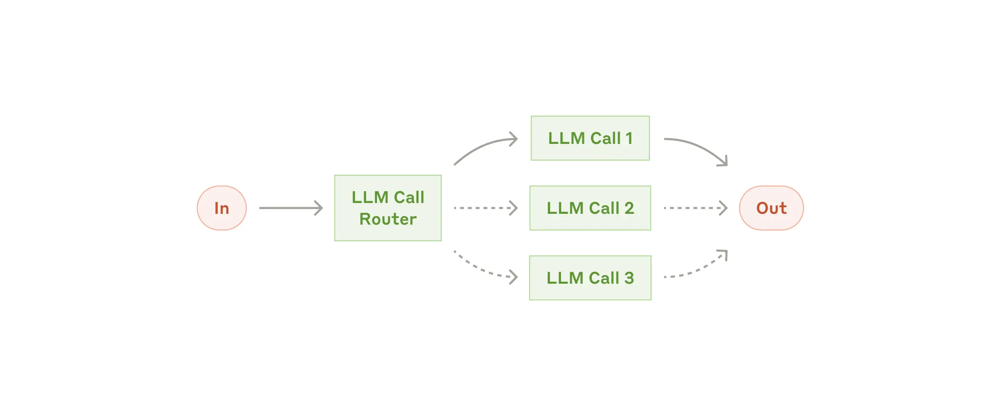
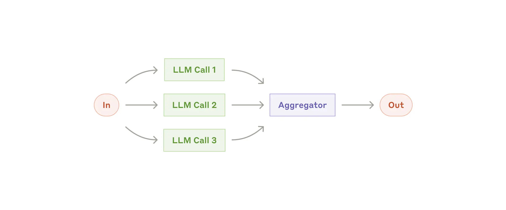
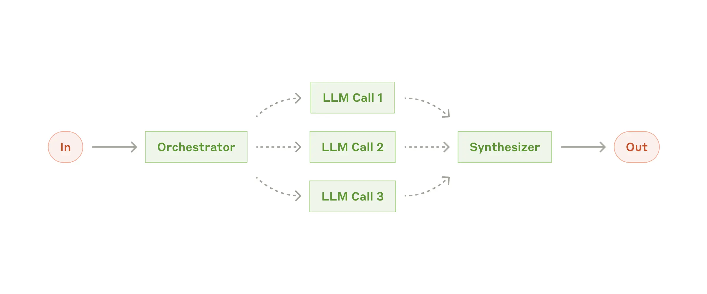
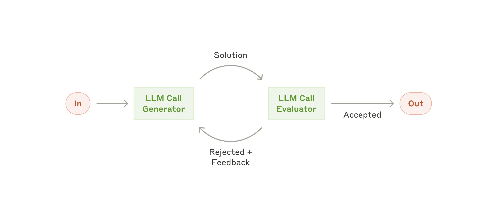
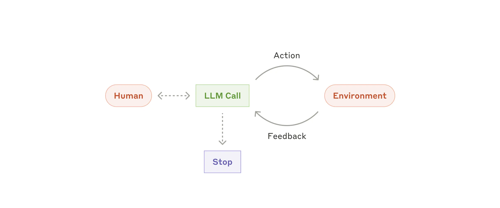
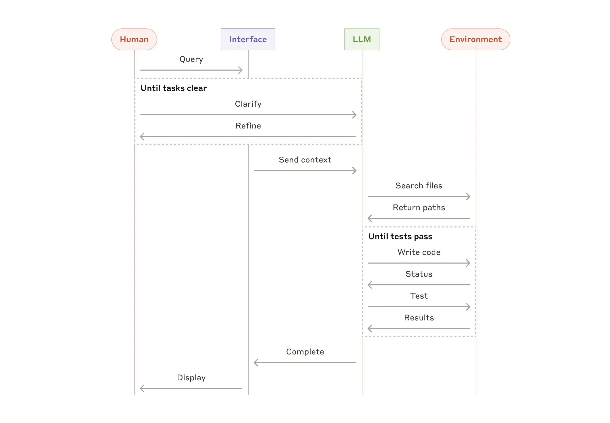

> 原文：[Building effective agents](https://www.anthropic.com/engineering/building-effective-agents) · Anthropic Engineering · 2024.12

## 一、基本概念

### 什么是智能体系统？

| 类型 | 定义 | 特点 |
|------|------|------|
| **工作流（Workflow）** | LLM 按预定义代码路径执行 | 可预测、一致性强 |
| **智能体（Agent）** | LLM 动态规划并自主调用工具 | 灵活、自主决策 |

两者统称为**智能体系统（Agentic Systems）**。

---

## 二、何时使用智能体？

**首要原则：从最简单的方案开始，只在必要时增加复杂度。**

```
单次 LLM 调用（优化 prompt）
    ↓ 不够时
工作流（Workflow）
    ↓ 不够时
智能体（Agent）
```

- 智能体系统以**更高延迟和成本**换取**更强的任务处理能力**
- 很多场景下，优化单次 LLM 调用 + 检索增强（RAG）已足够

---

## 三、关于框架的建议

常见框架：Claude Agent SDK、Strands Agents SDK、Rivet、Vellum 等。

**建议：**
- ✅ 优先直接调用 LLM API，大多数模式几十行代码即可实现
- ✅ 使用框架前，确保理解其底层实现
- ⚠️ 框架的抽象层会掩盖 prompt 和响应，增加调试难度

---

## 四、流程编排模式

本节将由简单到复杂的探讨生产中常见的智能系统模式，从基础的 Augmented LLM 开始逐步增加复杂度，从简单的组合 Workflow 到 Autonomous Agents。

### 4.1 The augmented LLM

增强型 LLM 是 Agentic 系统的基本构建模块，它通过检索、工具和内存等进行功能增强的 LLM。让现有模型可以主动利用这些能力，例如生成适合的搜索查询、选择合适的工具、并确定要保留的信息。


在实现时，需要根据具体用例定制这些能力，并确保它们可以为 LLM 提供一个简便且文档完善的接口。虽然实现这些增强有多种方式，但其中一种方法是通过 Model Context Protocol（MCP）。它允许开发者通过简单的客户端实现，与不断增长的第三方工具生态系统集成。

---

### 4.2 Workflow: Prompt chaining

提示链模式将任务分解为一系列步骤，每个 LLM 调用的输入，都是前一个调用的输出。两次调用之间可插入校验逻辑，确保流程仍在按预期进行。


**适用场景：**
- 任务可清晰分解为固定子步骤
- 追求更高准确率，可接受更长延迟

**示例：**
- 先生成营销文案 → 再翻译成目标语言
- 先写大纲 → 校验大纲 → 再写正文

---

### 4.3 Workflow: Routing

路由模式首先对输入分类，并将其分别导向到专门的后续任务。这种工作流程允许关注点分离，并构建更专业的提示。没有这个工作流程，针对一种输入类型优化可能会影响其他输入的性能。



**适用场景：**
- 复杂任务，输入具有不同类别且差异较大
- 各类别处理逻辑互不干扰

**示例：**
- 客服系统：将退款/技术支持/一般咨询分别路由到不同流程
- 按问题难度路由：简单问题 → 小模型（省成本），复杂问题 → 大模型（保质量）

---

### 4.4 Workflow: Parallelization

并行化模式多次调用 LLM 同时处理同一任务，并以程序方式汇总输出。有两种典型场景（1）分段（Sectioning）：将任务拆分为独立子任务并行执行；（2）投票（Voting）：同一任务多次运行，获取多样或共识输出。



**适用场景：**
- 分开的自认为可以并行处理，或者需要多角度尝试获取更高置信度
- 对于需要多重考量的复杂任务，LLM 通常在每个考量独立调用时表现更好

**示例**

| 变体 | 示例 |
|------------------|
| **分段（Sectioning）**  | 实现保护栏，内容审核与正常回复同时进行 |
| **投票（Voting）** | 多角度代码漏洞扫描、评估某项内容是否合适，取共识结果避免假阳性/假阴性 |

---

### 4.5 Workflow: Orchestrator-Workers

编排者-工作者模式，会有一个中央 LLM 负责动态拆解任务，委派给工作型 LLM 并综合它们的结果。



**与并行化的区别：** 并行化的子任务是预定义的；编排者模式的子任务由 LLM 根据具体输入动态生成。

**适用场景：**
- 无法事先预知需要哪些子任务，例如编程类任务（需修改的文件数量和内容因需求而异）
- 多源信息搜集与分析

---

### 4.6 Workflow: Evaluator-Optimizer

评估器-优化器模式中有一个 LLM 负责生成结果，另一个 LLM 负责评估并反馈，形成迭代优化循环。



**适用场景：**
- 有明确的评估标准
- 迭代改进能带来可衡量的提升

**示例：**
- 文学翻译：评估者指出细节缺失，生成者重新翻译
- 复杂信息检索：评估者判断是否需要继续搜索

---

### 4.7 Agent

随着 LLM 在关键能力上的成熟，理解复杂输入、进行推理和规划、可靠使用工具以及从错误中恢复，Agent 正在生产环境中涌现。Agent 接收人类用户的指令，一旦任务明确，Agents 会独立规划和行动，也可能会回访人类获取更多信息或判断。在执行过程中，Agent 必须在每个步骤（如工具调用结果或代码执行）中获得环境的“真实反馈”，以评估其进展。Agent 可以在检查点或遇到阻碍时暂停等待人工反馈。任务通常在完成后终止，但通常也会包含停止条件（如最大迭代次数）以保持控制。Agent 可以处理复杂的任务，但其实现通常很简单。它们通常只是基于环境反馈的工具循环的大型语言模型。因此，清晰且深思熟虑地设计工具集及其文档至关重要。



**适用场景：**
- 任务步骤数量无法预先确定，且无法硬编码处理的开放式问题
- 需要复杂推理和动态决策

**注意事项：**
- 自主性越高，成本越高，错误累积风险也越大
- 建议在沙盒环境中充分测试，并设置合理的终止条件和护栏

**成功案例：**
- 目前被广泛使用的 Coding agent




### 4.8 组合和定制这些模式

这些构建模块并非强制性。它们是开发者可以塑造和组合以适应不同用例的常见模式。成功的关键，和任何大型语言模型功能一样，在于衡量性能并不断迭代实现。再说一遍： 只有当它明显改善了结果时，才应该考虑增加复杂度。

---

## 五、总结

### 5.1 实际应用场景

#### 客户支持

- 对话流 + 工具调用（查订单、调知识库）天然结合
- 操作可程序化（退款、更新工单）
- 成功与否可量化衡量

#### 代码智能体

- 代码可通过测试自动验证
- 测试结果可作为迭代反馈
- 问题空间结构清晰，质量可客观度量

### 5.2 工具设计最佳实践

工具文档需要像 prompt 一样精心设计，可理解为**智能体-计算机接口（ACI）**。

**设计原则：**

1. **站在模型角度审视**：工具描述是否清晰？参数是否直观？
2. **写好文档**：包含用途说明、参数说明、示例用法、边界情况
3. **实测验证**：在 workbench 中用大量真实输入测试，观察模型的实际使用行为
4. **防错设计（Poka-yoke）**：修改参数设计，让错误更难发生

**格式选择建议：**
- 给模型足够的 token "思考空间"
- 选择接近自然语言语料的格式（如 Markdown 优于 JSON 转义代码）
- 避免需要维护精确计数或复杂转义的格式

> 💡 **实践经验**：Anthropic 在构建 SWE-bench Agent 时，花在工具优化上的时间超过了 prompt 优化。例如，将文件路径参数从相对路径改为绝对路径，彻底解决了路径错误问题。

### 5.3 三条核心原则

1. **保持简洁（Simplicity）**：智能体设计不要过度复杂
2. **透明可见（Transparency）**：明确展示智能体的规划步骤
3. **工具文档（Documentation）**：精心设计并测试每一个工具

**核心思路：先用最简单的方案，只在简单方案确实不足时，才逐步引入复杂度。**